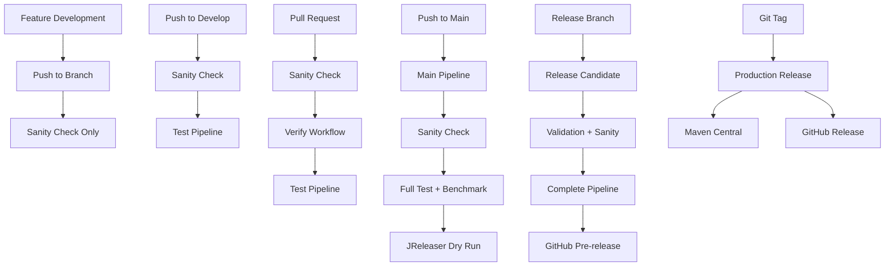

# CI/CD Pipeline Guide

This document provides a comprehensive overview of the CI/CD pipeline for the DynamoDB PartiQL JDBC Driver project.

## 🏗️ Pipeline Overview

The CI/CD pipeline consists of multiple workflows designed to ensure code quality and reliable deployments:



## 📋 Workflow Details

### 1. Sanity Check (`sanity.yml`) - Universal Foundation
**Triggers:** Every push (except main/release branches), every pull request, workflow_call  
**Purpose:** Fast validation and universal foundation for all workflows  

**Steps:**
- ✅ Code formatting validation (Spotless)
- ✅ Dependency download and compilation
- ✅ Javadoc generation
- ✅ Basic validation checks

**Duration:** ~2-3 minutes
**Role:** Always runs first, gates other workflows

### 2. Enhanced Testing (`test.yml`)
**Triggers:** Push to develop only, pull requests to main/develop, workflow_call  
**Purpose:** Comprehensive testing with streamlined approach  

**Test Configuration:**
- **Java Version:** 21 (Ubuntu only)
- **Test Types:** Unit, Integration, Quality Gate (Performance tests handled by benchmark.yml)
- **Integration:** Testcontainers with DynamoDB Local

**Jobs:**
1. **Unit Tests** - Fast unit test execution (excludes performance tests)
2. **Integration Tests** - Testcontainers with DynamoDB Local
3. **Code Coverage** - JaCoCo reporting (80% minimum, excludes performance tests)
4. **Quality Gate** - Spotless, compilation, Javadoc validation

**Duration:** ~8-12 minutes

### 3. Verify Workflow (`verify.yml`)
**Triggers:** After successful sanity on pull requests  
**Purpose:** Deep integration validation for PRs  

**Steps:**
- Full Maven verify with Testcontainers
- Integration testing with real DynamoDB Local
- Test and coverage artifact uploads

**Duration:** ~5-7 minutes

### 4. Main Branch Pipeline (`main-pipeline.yml`)
**Triggers:** Push to main branch only  
**Purpose:** Ensure main branch is always release-ready  

**Complete Pipeline:**
1. **Sanity Check** (foundation)
2. **Parallel Execution:**
   - Full Test Pipeline (reusable workflow)
   - Performance Benchmark (reusable workflow)
3. **Validation & JReleaser Dry Run**
4. **Pipeline Summary** with release readiness report

**Duration:** ~15-20 minutes

### 5. Performance Benchmarking (`benchmark.yml`)
**Triggers:** Labeled PRs to main, weekly schedule, manual dispatch, workflow_call  
**Purpose:** Performance regression detection  

**Features:**
- Baseline vs. current performance comparison
- Automated regression detection (>10% threshold)
- Historical performance tracking
- PR comments with benchmark results
- Testcontainers integration for realistic testing

**Duration:** ~10-15 minutes

### 6. Release Candidate (`release-candidate.yml`)
**Triggers:** Push to `release/*` branches, manual dispatch  
**Purpose:** Pre-release validation and artifact creation  

**Sequential Execution:**
1. **Validation** - Version and SNAPSHOT checks
2. **Sanity Check** (foundation)
3. **Parallel Execution:**
   - Full test pipeline
   - Performance benchmarking
4. **Build Artifacts** - JAR, sources, Javadoc with checksums
5. **JReleaser Dry Run** - Release configuration validation
6. **GitHub Pre-release** - Automated pre-release creation

**Duration:** ~20-25 minutes

### 7. Production Release (`release.yml`)
**Triggers:** Git tags (`v*.*.*`)  
**Purpose:** Automated Maven Central publishing  

**Features:**
- JReleaser full release execution
- Maven Central artifact publishing
- GitHub release creation with changelog
- Artifact signing and verification

**Important:** This workflow runs independently and does NOT trigger other workflows:
- Sanity.yml ignores tags (`tags-ignore: ['v*.*.*']`)
- Test, benchmark, and verify workflows don't have tag triggers
- Assumes all validation was completed before tag creation

**Duration:** ~10-15 minutes


## 🔄 Workflow Execution Patterns

### **Feature Development** - Sanity Only

```
Push to feature-branch → sanity.yml (2-3 min)
```

### **Develop Branch** - Sanity + Testing

```
Push to develop → sanity.yml (2-3 min)
                     ↓ (success required)
                  test.yml (8-12 min)
```
**Total:** ~10-15 minutes

### **Pull Request** - Sequential Validation

```
PR to main/develop → sanity.yml (2-3 min)
                        ↓ (success required)
                     verify.yml (5-7 min)
                        ↓ (success required)
                  test.yml (10-15 min)
```
**Total:** ~17-25 minutes

### **Main Branch** - Complete Pipeline

```
Push to main → main-pipeline.yml:
    sanity.yml (2-3 min)
        ↓ (success required)
    ┌─ test.yml (8-12 min)        ┐
    └─ benchmark.yml (10-15 min)  ┘ ─ Parallel execution
        ↓ (all complete)
    validation + dry-run (5-7 min)
```
**Total:** ~15-20 minutes

### **Release Branch** - Full Validation

```
Push to release/* → release-candidate.yml:
    validation → sanity.yml → [test + benchmark] → artifacts + dry-run
```
**Note:** Individual workflows (sanity, test, benchmark) do NOT trigger on release branches

### **Tag Release** - Direct Publishing

```
Push tag v*.*.* → release.yml ONLY:
    JReleaser full release → Maven Central + GitHub Release
```
**Note:** NO other workflows trigger on tags - assumes validation already complete

## 🔧 Environment Variables & Secrets

### Required GitHub Secrets

| Secret | Purpose | Required For |
|--------|---------|--------------|
| `GITHUB_TOKEN` | API access, releases | Automatic (provided by GitHub) |
| `CODECOV_TOKEN` | Coverage reporting | Optional (recommended) |
| `GPG_PRIVATE_KEY` | Artifact signing | Maven Central publishing |
| `GPG_PASSPHRASE` | GPG key passphrase | Maven Central publishing |
| `MAVEN_CENTRAL_USERNAME` | Sonatype OSSRH username | Maven Central publishing |
| `MAVEN_CENTRAL_PASSWORD` | Sonatype OSSRH password | Maven Central publishing |

**Note:** JReleaser requires the GitHub token to be available via multiple methods:
- Environment variable: `JRELEASER_GITHUB_TOKEN`
- System property: `-Djreleaser.github.token`
- Both are configured automatically in all release workflows

### Automatic Environment Variables

```yaml
# DynamoDB testing (set automatically for integration tests only)
# Unit tests run WITHOUT these variables to test validation
AWS_ACCESS_KEY_ID: "fakeMyKeyId"        # Only for integration tests
AWS_SECRET_ACCESS_KEY: "fakeSecretAccessKey"  # Only for integration tests
AWS_DEFAULT_REGION: "us-east-1"         # Only for integration tests

# Testcontainers configuration
TESTCONTAINERS_RYUK_DISABLED: "true"
TESTCONTAINERS_CHECKS_DISABLE: "true"

# Maven optimization
MAVEN_OPTS: "-Dhttps.protocols=TLSv1.2 -Dmaven.repo.local=${{ github.workspace }}/.m2/repository"
```

## 🚀 Development Workflow

### Daily Development Flow

```bash
# Fast feedback loop
git push origin feature-branch
# → Triggers: sanity.yml only (2-3 minutes)
```

### Develop Branch Flow

```bash
# Development with testing
git push origin develop
# → Triggers: sanity.yml → test.yml (10-15 minutes)
```

### Pull Request Flow

```bash
# Comprehensive validation
git push origin feature-branch
# Create PR to main/develop
# → Triggers: sanity.yml → verify.yml → test.yml
```

### Main Branch Flow

```bash
# Release readiness validation
git push origin main  
# → Triggers: main-pipeline.yml (full validation + dry run)
```

### Release Flow

```bash
# Release candidate
git checkout -b release/1.0.0
git push origin release/1.0.0
# → Triggers: release-candidate.yml (complete validation + pre-release)

# Production release
git tag v1.0.0
git push origin v1.0.0
# → Triggers: release.yml (Maven Central publishing)
```

## 📊 Quality Gates

### Code Coverage

- **Minimum Overall Coverage:** 80%
- **Minimum Changed Files Coverage:** 80%
- **Tool:** JaCoCo with PR comments
- **Reports:** Available as artifacts and PR comments

### Performance Regression

- **Threshold:** 10% increase in execution time
- **Action:** Warning in PR, manual review required
- **Tracking:** Historical data stored for trending

### Test Result Display Features

- **GitHub Checks:** Automated test result status checks
- **PR Comments:** Consolidated test result summaries with:
  - Unit and integration test results
  - Performance benchmark comparisons
  - Code coverage reports with visual indicators
  - Quality gate status
- **Workflow Summaries:** Visual test result tables in GitHub Actions summaries
- **Test Reports:** dorny/test-reporter integration for detailed test result display
- **Artifact Uploads:** All test reports, coverage data, and performance results available as downloadable artifacts

## 🔄 Complete Workflow Triggers Matrix

| Workflow | Feature Push | Develop Push | Main Push | PR | Release Branch | Git Tag | Schedule |
|----------|--------------|--------------|-----------|----|--------------|---------|------------|
| sanity.yml | ✅ | ✅ | ❌ | ✅ | ❌ | ❌ | ❌ |
| test.yml | ❌ | ✅ | ❌ | ✅ | ❌ | ❌ | ❌ |
| verify.yml | ❌ | ❌ | ❌ | ✅ | ❌ | ❌ | ❌ |
| main-pipeline.yml | ❌ | ❌ | ✅ | ❌ | ❌ | ❌ | ❌ |
| benchmark.yml | ❌ | ❌ | ❌ | ✅** | ❌ | ❌ | Weekly |
| release-candidate.yml | ❌ | ❌ | ❌ | ❌ | ✅ | ❌ | Manual |
| release.yml | ❌ | ❌ | ❌ | ❌ | ❌ | ✅ | ❌ |

**Notes:**
- Sanity, test, and benchmark workflows do NOT trigger directly on main/release branches/tags
- They are called via `workflow_call` from main-pipeline.yml or release-candidate.yml
- This prevents duplicate workflow runs when pushing to protected branches
- release.yml runs standalone - it does NOT call other workflows
** Only with 'performance' label on PRs

## 🛠️ Local Development

### Running Tests Locally

```bash
# Unit tests only
./mvnw test -Dtest="!*IntegrationTest,!*Integration"

# Integration tests (Testcontainers handles DynamoDB Local)
./mvnw test -Dtest="*IntegrationTest,*Integration"

# Performance tests
./mvnw test -Dtest="*PerformanceTest"

# All tests with coverage
./mvnw verify
```

### Code Quality Checks

```bash
# Format code
./mvnw spotless:apply

# Check formatting
./mvnw spotless:check

# Generate Javadocs
./mvnw javadoc:javadoc

```

### Release Testing

```bash
# Test JReleaser configuration
./mvnw jreleaser:config -Djreleaser.dry-run=true

# Build release artifacts
./mvnw clean package -DskipTests
```

## 📈 Performance Optimization

### Build Speed Optimization

- **Sanity Foundation:** Fast failure prevents resource waste
- **Simplified Matrix:** Single OS/JDK for regular testing
- **Parallel Execution:** After sanity success, workflows run concurrently
- **Conditional Execution:** Different triggers for different scenarios
- **Caching:** Maven dependencies cached across runs

### Resource Efficiency

- **Concurrency Control:** Cancel outdated workflow runs
- **Targeted Testing:** Comprehensive testing only when needed
- **Scheduled Scans:** Security scans during off-peak hours
- **Artifact Cleanup:** Automated retention policies

## 🚨 Troubleshooting

### Common Issues

1. **Test Failures**
   - Testcontainers will handle DynamoDB Local automatically
   - Check container startup logs in workflow output
   - Verify test isolation and cleanup

2. **Build Failures**
   - Clear Maven cache: `./mvnw dependency:purge-local-repository`
   - Check Java 21 compatibility
   - Verify Maven wrapper permissions

3. **JReleaser Issues**
   - Verify all required secrets are configured
   - Check JReleaser dry run output in artifacts
   - Ensure version format matches tag format

5. **Workflow Dependencies**
   - If sanity fails, all dependent workflows are skipped
   - Check sanity logs first for basic compilation/formatting issues
   - Ensure proper Maven wrapper permissions on Unix systems

### Getting Help

- **Workflow Logs:** Available in GitHub Actions tab
- **Artifacts:** Download build outputs and reports
- **Issues:** Create GitHub issues with simple issue template

## 📊 Test Result Display & Reporting

### Enhanced Test Visibility

The CI/CD pipeline provides comprehensive test result visibility through multiple channels:

#### GitHub Checks Integration
- **Status Checks**: All workflows provide status check integration
- **Test Reporter**: dorny/test-reporter provides detailed test result breakdowns
- **Quality Gates**: Automatic pass/fail indicators for all quality requirements

#### Pull Request Comments
- **Consolidated Test Summary**: Automated comments showing:
  - Unit test results (count, duration, success rate)
  - Integration test results with DynamoDB Local status
  - Performance benchmark comparison with baseline
  - Code coverage percentage with file-level details
  - Quality gate status for all requirements
- **Auto-Update**: Comments are updated on subsequent pushes
- **Visual Indicators**: Emoji-based status indicators for quick scanning

#### Workflow Summaries
- **Pipeline Status Tables**: Visual tables showing component status
- **Test Results Overview**: Comprehensive test execution summaries
- **Release Readiness**: Clear indicators of release readiness
- **Troubleshooting Guidance**: Specific action items for failures

#### Performance Benchmarking
- **Regression Detection**: Automatic detection of 10%+ performance regressions
- **Trend Analysis**: Historical performance tracking on main branch
- **Visual Comparisons**: Side-by-side performance metrics
- **Optimization Tips**: Automated guidance for performance improvements

#### Downloadable Artifacts
- **Test Reports**: Complete Surefire test reports in XML and HTML
- **Coverage Reports**: JaCoCo coverage reports with branch/line details
- **Performance Data**: Benchmark results and historical trends
- **Build Artifacts**: JAR files with checksums for validation

### Test Report Locations

| Report Type | Location | Retention |
|-------------|----------|-----------|
| Test Results | GitHub Checks & PR Comments | Permanent |
| Coverage Reports | Artifacts & PR Comments | 30 days |
| Performance Benchmarks | Artifacts & PR Comments | 30-90 days |
| Build Artifacts | Workflow artifacts | 14-30 days |
| Historical Performance | main branch artifacts | 90 days |

## 📝 Maintenance

### Regular Tasks

- **Weekly:** Review and merge Dependabot PRs
- **Monthly:** Review workflow performance and optimization
- **Annually:** Update base actions and tool versions

### Monitoring Points

- **Build Success Rate:** Target >95%
- **Test Execution Time:** Monitor for performance regressions
- **Main Branch Health:** Should always be release-ready
- **Sanity Check Success:** Should be >99% (basic quality gate)
- **Test Result Visibility:** Ensure all test reports are generated and accessible

## 🎯 Best Practices

### Development
1. **Fast Feedback:** Sanity checks provide immediate validation
2. **Branch Strategy:** Different validation levels for different branches
3. **Release Readiness:** Main branch always validated and ready
4. **Clean History:** Squash commits when merging

### Releases
1. **Release Candidates:** Always test via release branches
2. **Version Consistency:** Ensure POM and tag versions match
3. **Documentation:** Update CHANGELOG.md for releases
4. **Validation:** JReleaser dry run before production release
5. **Sequential Validation:** Sanity → comprehensive testing → release

## 📊 Workflow Dependencies

```text
sanity.yml (Universal Foundation)
    ↓
┌─ verify.yml (PR only)     ┐
├─ test.yml (develop/main)  ├─ Independent workflows
└─ benchmark.yml (main/PR)  ┘  after sanity success
    ↓
main-pipeline.yml (orchestrates all for main)
release-candidate.yml (orchestrates all for releases)
```

This optimized CI/CD pipeline provides fast development feedback while ensuring comprehensive validation for releases, with sanity checks as the universal foundation that gates all other workflow execution.
